# Домашнее задание к занятию «Введение в Terraform» - Илларионов Дмитрий

### Цели задания

1. Установить и настроить Terrafrom.
2. Научиться использовать готовый код.

------

### Чек-лист готовности к домашнему заданию

1. Скачайте и установите **Terraform** версии =1.5.Х (версия 1.6 может вызывать проблемы с Яндекс провайдером) . Приложите скриншот вывода команды ```terraform --version```.

Поднял ВМ в облаке и через терраформ с локального ПК на Win - поднял ВМ и там установил терраформ (и не только):

```
  provisioner "remote-exec" {
    inline = [
    "sudo apt-get update",
    "sudo apt-get install -y ca-certificates curl gnupg",
    "sudo install -m 0755 -d /etc/apt/keyrings",
    "curl -fsSL https://download.docker.com/linux/ubuntu/gpg | sudo gpg --dearmor -o /etc/apt/keyrings/docker.gpg",
    "sudo chmod a+r /etc/apt/keyrings/docker.gpg",
    "echo \"deb [arch=\"$(dpkg --print-architecture)\" signed-by=/etc/apt/keyrings/docker.gpg] https://download.docker.com/linux/ubuntu \"$(. /etc/os-release && echo \"$VERSION_CODENAME\")\" stable\" |  sudo tee /etc/apt/sources.list.d/docker.list > /dev/null",
    "sudo apt-get update",
    "sudo apt-get install -y docker-ce docker-ce-cli containerd.io docker-buildx-plugin docker-compose-plugin",
    "sudo chmod +x /root/proxy.yaml",
    "apt install -y mariadb-client-core-10.6 ",
    "wget https://hashicorp-releases.yandexcloud.net/terraform/1.5.5/terraform_1.5.5_linux_amd64.zip",
    "apt install -y unzip",
    "unzip terraform_1.5.5_linux_amd64.zip -d /root",
    "mv /root/terraform /bin/trr",
    "trr -v"
    ]
  }
```

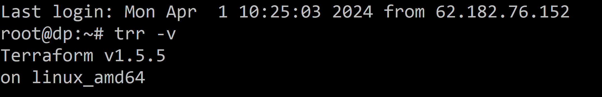

2. Скачайте на свой ПК этот git-репозиторий. Исходный код для выполнения задания расположен в директории **01/src**.
3. Убедитесь, что в вашей ОС установлен docker.
4. Зарегистрируйте аккаунт на сайте https://hub.docker.com/, выполните команду docker login и введите логин, пароль.

------

### Инструменты и дополнительные материалы, которые пригодятся для выполнения задания

1. Репозиторий с ссылкой на зеркало для установки и настройки Terraform: [ссылка](https://github.com/netology-code/devops-materials).
2. Установка docker: [ссылка](https://docs.docker.com/engine/install/ubuntu/). 
------
### Внимание!! Обязательно предоставляем на проверку получившийся код в виде ссылки на ваш github-репозиторий!
------

### Задание 1

1. Перейдите в каталог [**src**](https://github.com/netology-code/ter-homeworks/tree/main/01/src). Скачайте все необходимые зависимости, использованные в проекте. 

_скопировал файл .terraformrc в домашнюю дирректорию, и после этого запустил проект

```
cp terraform-vvedenie/src/.terraformrc .
cd terraform-vvedenie/src~
trr init
```

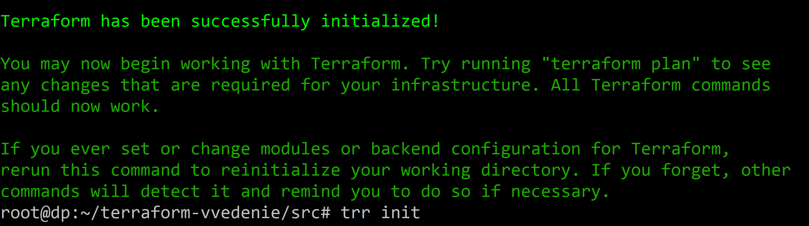


2. Изучите файл **.gitignore**. В каком terraform-файле, согласно этому .gitignore, допустимо сохранить личную, секретную информацию?

_можно хранить в файле personal.auto.tfvars_

3. Выполните код проекта. Найдите  в state-файле секретное содержимое созданного ресурса **random_password**, пришлите в качестве ответа конкретный ключ и его значение.

```
            "result": "0ME8K8JVS9iKVIpz"
```
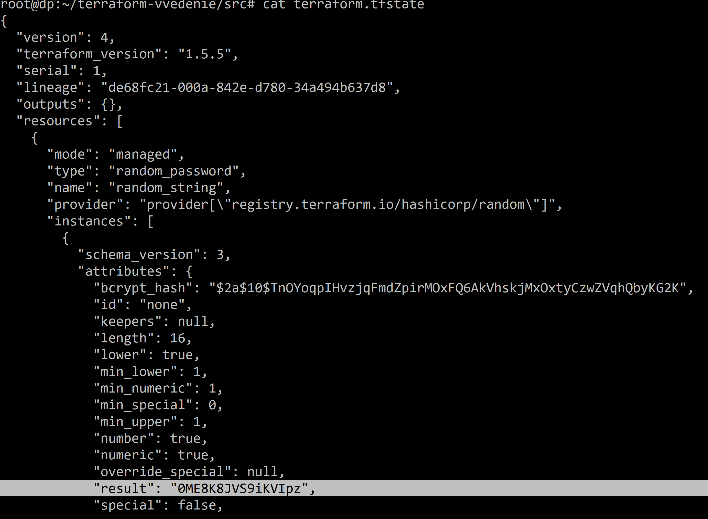

4. Раскомментируйте блок кода, примерно расположенный на строчках 29–42 файла **main.tf**.
_ошибка:_

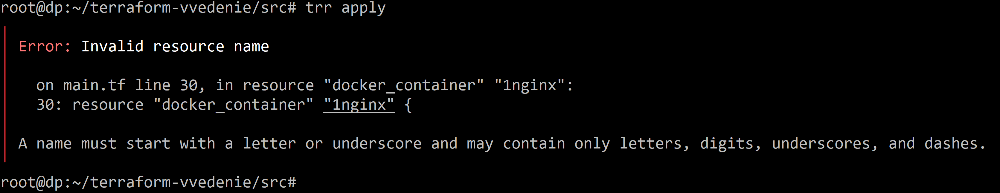

Исправляю, но, еще ошибки:

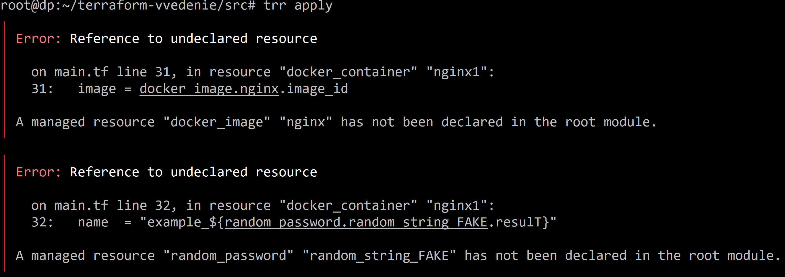

Исправил все ошибки:

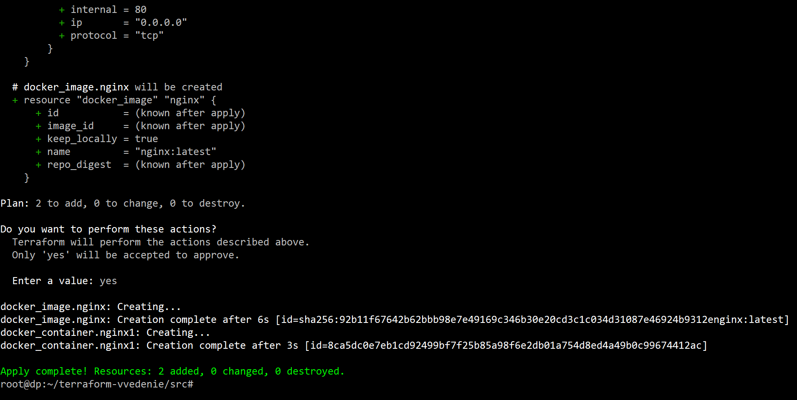


Выполните команду ```terraform validate```. Объясните, в чём заключаются намеренно допущенные ошибки. Исправьте их.

Уже все исправил, но, например была ошибка:
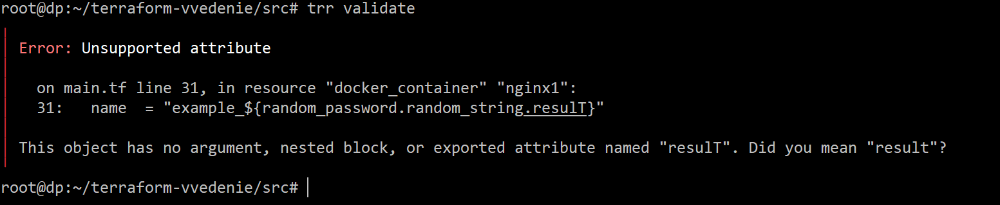

большая буква в место маленьких и др.

5. Выполните код. В качестве ответа приложите: исправленный фрагмент кода и вывод команды ```docker ps```.

_код см. в репозитории_

и копия:

```
terraform {
  required_providers {
    docker = {
      source  = "kreuzwerker/docker"
      version = "~> 3.0.1"
    }
  }
  required_version = ">=0.13" /*Многострочный комментарий.
 Требуемая версия terraform */
}
provider "docker" {}

#однострочный комментарий

resource "random_password" "random_string" {
  length      = 16
  special     = false
  min_upper   = 1
  min_lower   = 1
  min_numeric = 1
}


resource "docker_image" "nginx" {
  name         = "nginx:latest"
  keep_locally = true
}

resource "docker_container" "nginx1" {
  image = docker_image.nginx.image_id
  name  = "example_${random_password.random_string.result}"

  ports {
    internal = 80
    external = 9090
  }
}

```
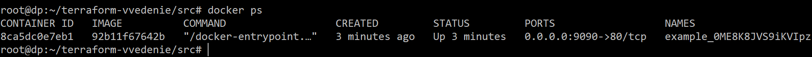

6. Замените имя docker-контейнера в блоке кода на ```hello_world```. Не перепутайте имя контейнера и имя образа. Мы всё ещё продолжаем использовать name = "nginx:latest". Выполните команду ```terraform apply -auto-approve```.

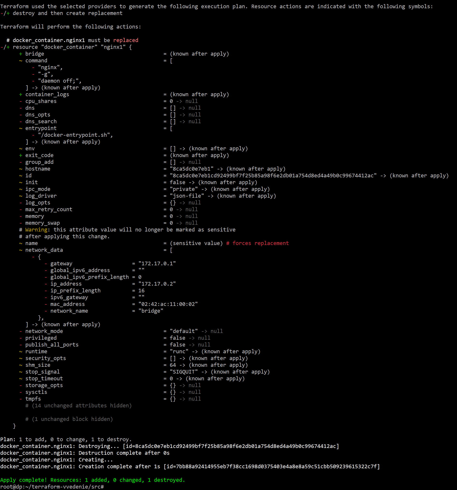

Объясните своими словами, в чём может быть опасность применения ключа  ```-auto-approve```. 

_мы можем ошибиться и без проверки удалить какой-то объект, если даже просто в его имени будет допущена опечатка, и т.п._

Догадайтесь или нагуглите зачем может пригодиться данный ключ?

_Если нужна автоматизация, например в CI/CD и где все уже давно проверено, и нужно автоматически запустить развертывание структуры._

 В качестве ответа дополнительно приложите вывод команды ```docker ps```.

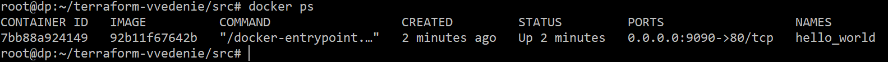

8. Уничтожьте созданные ресурсы с помощью **terraform**. Убедитесь, что все ресурсы удалены. Приложите содержимое файла **terraform.tfstate**. 

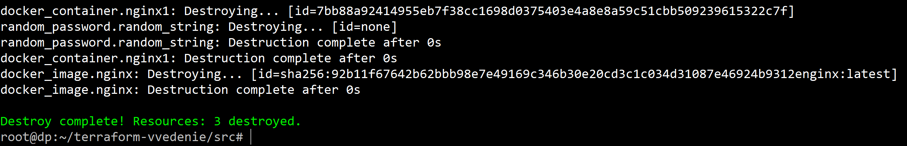


9. Объясните, почему при этом не был удалён docker-образ **nginx:latest**. Ответ **ОБЯЗАТЕЛЬНО НАЙДИТЕ В ПРЕДОСТАВЛЕННОМ КОДЕ**, а затем **ОБЯЗАТЕЛЬНО ПОДКРЕПИТЕ** строчкой из документации [**terraform провайдера docker**](https://docs.comcloud.xyz/providers/kreuzwerker/docker/latest/docs).  (ищите в классификаторе resource docker_image )

_потому что использовали параметр   keep_locally = true при создании имаджа. В документации сказано:_

_*keep_locally (Boolean) If true, then the Docker image won't be deleted on destroy operation. If this is false, it will delete the image from the docker local storage on destroy operation.*_

https://docs.comcloud.xyz/providers/kreuzwerker/docker/latest/docs/resources/image

------

## Дополнительное задание (со звёздочкой*)

**Настоятельно рекомендуем выполнять все задания со звёздочкой.** Они помогут глубже разобраться в материале.   
Задания со звёздочкой дополнительные, не обязательные к выполнению и никак не повлияют на получение вами зачёта по этому домашнему заданию. 

### Задание 2*

1. Создайте в облаке ВМ. Сделайте это через web-консоль, чтобы не слить по незнанию токен от облака в github(это тема следующей лекции). Если хотите - попробуйте сделать это через terraform, прочитав документацию yandex cloud. Используйте файл ```personal.auto.tfvars``` и гитигнор или иной, безопасный способ передачи токена!

_Через терраформ создал еще одну ВМ рядом - vm2._

2. Подключитесь к ВМ по ssh и установите стек docker.

_стек докера тоже через терраформ установил_
_на первую ВМ установил Terraform и с нее подключась ко второй_
_для создания контейнера с mysql создал отдельный tf файл в src/ - mysql.tf -там можно код посмотреть (см. в репозитории)_
_и для разворачивания двух ВМ я сделал массив из object переменной, в которых указал параметры ВМ и команды начальные. Но, добиться работы с object смог только через countindex. Через for_each не получилось, т.к. не получается считать объект list - там где команды. Какие будут рекомендации по улучшению кода?
Как можно сделать через for_each ?_

3. Найдите в документации docker provider способ настроить подключение terraform на вашей рабочей станции к remote docker context вашей ВМ через ssh.

_нашел, нужно только ключ закрытый еще подложить в .ssh. (я так понял) - это пока вручную сделал, почему-то через терраформ что-то не заработало, пока не было времени разбираться_
_и права на ключ лишние убрать - что бы только для root был доступен_

4. Используя terraform и  remote docker context, скачайте и запустите на вашей ВМ контейнер ```mysql:8``` на порту ```127.0.0.1:3306```, передайте ENV-переменные. Сгенерируйте разные пароли через random_password и передайте их в контейнер, используя интерполяцию из примера с nginx.(```name  = "example_${random_password.random_string.result}"```  , двойные кавычки и фигурные скобки обязательны!) 
```
    environment:
      - "MYSQL_ROOT_PASSWORD=${...}"
      - MYSQL_DATABASE=wordpress
      - MYSQL_USER=wordpress
      - "MYSQL_PASSWORD=${...}"
      - MYSQL_ROOT_HOST="%"
```

Пока так и не удалось решить задачу как передать переменные. Пробовал разные способы, думал сделать так как и порты определяются, но для env так не заработало:

```
resource "docker_container" "mysql" {
  image = docker_image.mysql.image_id
  name  = "mysql"
  env {
    MYSQL_ROOT_PASSWORD = "${random_password.ROOT_PASSWORD.result}"
    MYSQL_DATABASE = "wordpress"
    MYSQL_USER = "wordpress"
    MYSQL_PASSWORD = "${random_password.MYSQL_PASSWORD.result}"
    MYSQL_ROOT_HOST = "%"
  }
```

В таком случае терраформ выадет ошибку и говорит что env должен быть определен т.е. должно быть env = ...

Тогда пробую так:

```
resource "docker_container" "mysql" {
  image = docker_image.mysql.image_id
  name  = "mysql"
  env = [
    "MYSQL_ROOT_PASSWORD = ${random_password.ROOT_PASSWORD.result}",
    "MYSQL_DATABASE = wordpress",
    "MYSQL_USER = wordpress",
    "MYSQL_PASSWORD = ${random_password.MYSQL_PASSWORD.result}",
    "MYSQL_ROOT_HOST = \"%\"" ]
```

Но, все равно контейнер валится, и в логах ошибка:

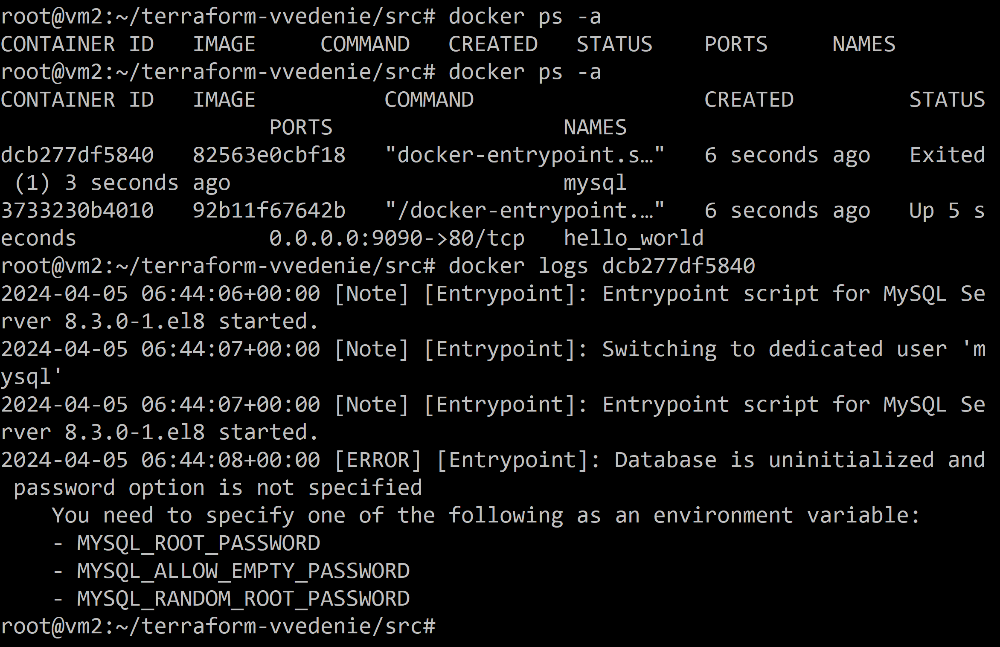

Что я делаю не так при передаче env в контейнер?


6. Зайдите на вашу ВМ , подключитесь к контейнеру и проверьте наличие секретных env-переменных с помощью команды ```env```. Запишите ваш финальный код в репозиторий.

Пока  ничего не передалось:

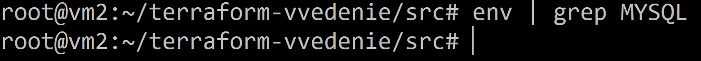

------

### Правила приёма работы

Домашняя работа оформляется в отдельном GitHub-репозитории в файле README.md.   
Выполненное домашнее задание пришлите ссылкой на .md-файл в вашем репозитории.

### Критерии оценки

Зачёт ставится, если:

* выполнены все задания,
* ответы даны в развёрнутой форме,
* приложены соответствующие скриншоты и файлы проекта,
* в выполненных заданиях нет противоречий и нарушения логики.

На доработку работу отправят, если:

* задание выполнено частично или не выполнено вообще,
* в логике выполнения заданий есть противоречия и существенные недостатки. 

